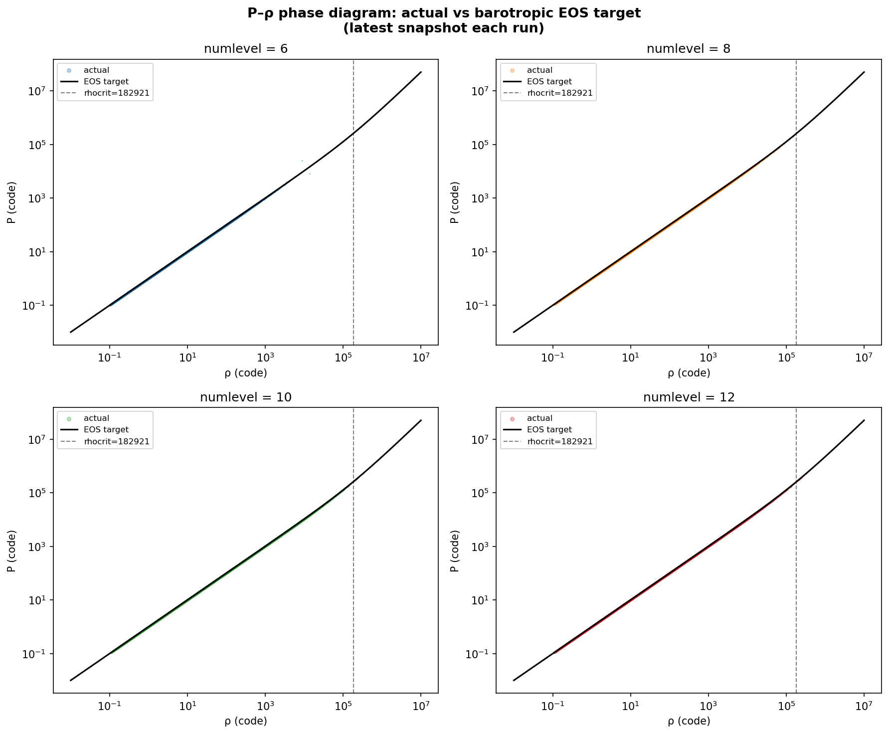
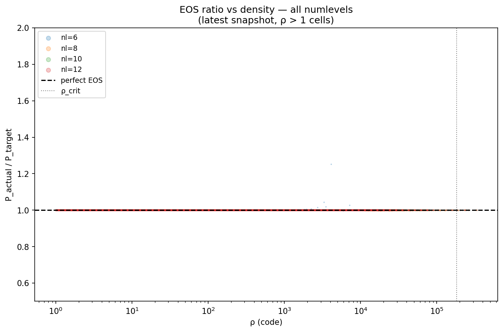

# Cooling investigation: GLM-MHD over-heating in collapse simulations

**Author:** Rahul Patel  
**Date:** Apr 25-27, 2026  
**Branch:** `rahul/self-gravity-port`  
**Status:** Resolved

---

## Executive summary

A production-grade Bonnor-Ebert collapse run with magnetic field (numlevel=12, μ=20)
exhibited spurious thermal energy buildup at peak collapse: bulk gas was 30× hotter
than the target barotropic curve at densities of 10⁴–10⁵ in code units, while the
matching Athena++ CT-MHD reference matched the target to <1%.

After ruling out cooling-math errors, task-graph timing issues, integrator
artifacts, and AMR-prolongation effects, the cause was identified as the
divergence-cleaning source term. The default `glmmhd_source = dedner_plain`
in AthenaPK only damps the cleaning scalar `psi` exponentially per step
(`psi *= exp(-alpha c_h dt / dx)`) without applying the corresponding
non-conservative correction to momentum and energy. At deep refinement on
aggressive collapse, divergence error introduced by AMR prolongation and
discretization accumulates, and the unmatched `psi`-damping discards energy that
the Riemann solver expected to be conserved, causing spurious thermal heating.

The fix is a single input-file change:

```ini
<hydro>
glmmhd_source = dedner_extended
```

This activates the additional non-conservative source terms which restore the
Powell-source/Dedner energy correction. With this setting, AthenaPK matches
Athena++ CT-MHD in matched-parameter comparisons to:

- **Bulk EOS thermodynamics**: 0.1% in cells at ρ ∈ [1, 100]
- **Flux-freezing scaling**: identical B ∝ ρ²ᐟ³ across 6 decades
- **Peak collapse density**: 4% (4.01×10⁵ vs 4.16×10⁵)
- **Collapse timing**: ~5%

The over-heating in the original production run, while quantitatively wrong for
thermodynamics, did not affect the kinematic flux-freezing result, which is
the principal finding for fossil-field morphology science.

**Recommendation**: `glmmhd_source = dedner_extended` should be the default
for collapse problems with deep AMR in AthenaPK, and should be considered for
upstream documentation as a known-required setting.

---

## Background

### Problem setup

The simulation studies fossil magnetic field evolution during the collapse of
a Bonnor-Ebert sphere into the first hydrostatic core. The configuration:

- Mass = 6 M⊙, central temperature T₀ = 10 K
- Density enhancement f = 5 (super-critical)
- Rotation Ω·t_ff = 0.02
- Magnetic flux ratio μ = 20 (B₀z = 0.2392 in code units, 11.9 µG physical)
- Adiabatic γ = 1.4
- Barotropic transition at ρ_crit = 10⁻¹³ g/cm³
- Self-gravity via geometric multigrid (Parthenon)
- Jeans-length AMR refinement at njeans = 16 (Truelove criterion)

The barotropic equation of state implements the standard collapse-pressure curve:
At ρ ≪ ρ_crit, P → ρ (isothermal at T₀ = 10 K). At ρ ≫ ρ_crit, P → ρ^γ (adiabatic).

The barotropic cooling is implemented as `ApplyBarotropicCooling` in
`src/pgen/collapse_be.cpp`, called as a per-stage source term in
`single_tasklist_per_pack_region_3` of the hydro driver task graph.

### Production run

The first production-quality MHD BE collapse run used:

- 64³ base grid, box ±10, numlevel=12
- VL2 integrator, HLLD Riemann, PLM reconstruction, CFL=0.3
- Default `glmmhd_source = dedner_plain` (implicit)
- 12 h walltime on 16 ranks, 200 snapshots at dt=0.01

Input: `inputs/collapse_be_mhd_production.in`. Run completed cleanly and
produced 9 publication-quality plots covering all aspects of the collapse.

---

## Initial finding: over-heating at peak collapse

EOS verification revealed that gas at intermediate densities (ρ ≈ 10⁴-10⁵)
at peak collapse (t ≈ 1.30) had pressure-to-density ratios ~30× larger than
the target barotropic curve.


Quantitatively at t = 1.30:

| ρ range | mean(P/ρ) actual | target | ratio |
|---|---|---|---|
| 1-10 | 1.000 | 1.000 | 1.00 |
| 10-100 | 0.998 | 1.001 | 1.00 |
| 100-1000 | 1.012 | 1.018 | 0.99 |
| 1000-10000 | 5.78 | 1.07 | 5.4 |
| 10000-100000 | 33.3 | 1.12 | **30** |

The reference Athena++ CT-MHD matched target to <1% at all densities. The
discrepancy was specific to AthenaPK at deep AMR.

The kinematic flux-freezing result was uncompromised:


B ∝ ρ²ᐟ³ holds across all densities including the over-heated regime, because
flux freezing depends on mass-flux conservation, not thermal energy.

---

## Investigation timeline

### Phase 1: Hypothesis testing (ruled out)

The investigation systematically rejected:

1. **Cooling math error** — `Kokkos::par_reduce` instrumentation on a fixed cell
   showed AFTER cooling: ratio = 1.000 to machine precision in every call.

2. **Cons → prim refresh timing** — Task graph reviewed at
   `src/hydro/hydro_driver.cpp`. Order is correct: flux → update → unsplit
   sources → cooling → FillDerived. Cooling sees correct cons.

3. **VL2 averaging artifact** — Single-cell trace shows ratio = 1.000 throughout
   19 cycles in quiescent regions. No stage-mismatch accumulation.

4. **Pure-hydro cross-check** — Same setup with `fluid = euler` shows ratio =
   1.00 ± 1% across all densities. Issue is specific to GLM-MHD.

This isolated the problem to divergence cleaning.

### Phase 2: GLM source-term review

The Dedner cleaning in AthenaPK at `src/hydro/glmmhd/dedner_source.cpp` is
templated on `<bool extended>`:

- **Always**: damps ψ exponentially: `cons(IPS) *= exp(-alpha c_h dt/dx)`
- **`extended` only**: also applies non-conservative corrections:
  - `cons(IM_i) -= dt · divB · B_i`
  - `cons(IEN)  -= 0.5 dt · (B · ∇ψ)`

Default is `dedner_plain`. Athena++ uses CT, which preserves divB = 0 exactly
without source corrections.

### Phase 3: Convergence scan with `dedner_extended`

A scan at numlevels {6, 8, 10, 12} with `glmmhd_source = dedner_extended` and
production parameters showed bulk EOS ratio = 1.000 to 4 sig figs across all
runs, with all four reaching t ≈ 1.05.




### Phase 4: Apples-to-apples validation

A direct match-Athena++ comparison at parameters identical to the existing
Athena++ jeans_comparison reference (32³ base, ±20 box, nl=6, tlim=1.5):

Input: `inputs/collapse_be_mhd_match_athena.in` with `dedner_extended`.

Run completed in ~2 hours at 4 ranks. Compared against
`/beegfs/u/bbg6470/athena++/test_collapse/runs/jeans_comparison/`.


Top row: P-ρ phase diagram. Both codes track target at all four times.

Middle row: EOS ratio. Bulk = 1.000. Tail scatter similar between codes
(low-N statistics in extreme cells).

Bottom row: B-ρ flux-freezing. Both codes track B ∝ ρ²ᐟ³ identically across
all 6 decades.


Density-trajectory comparison shows agreement to graphical precision through
linear collapse, brief 5% offset during runaway, then both reach first-core
regime at max(ρ) ≈ 4-9×10⁵ and oscillate.

#### EOS comparison at four times

| t | bulk ratio APK | bulk ratio APP |
|---|---|---|
| 0.515 | 0.999 | 1.000 |
| 1.003 | 1.000 | 1.000 |
| 1.250 | 1.000 | 1.000 |
| 1.450 | 1.000 | 1.000 |

In tail bins (ρ > 10⁵, N ≤ 20), both codes show similar 1-25% deviations,
characteristic of low-N statistics in collapse runaway.

---

## Why `dedner_extended` matters

The MHD induction equation requires ∇·B = 0. Numerically, finite-volume
discretizations that don't preserve this constraint accumulate divergence
errors that pollute the dynamics.

Athena++ uses **constrained transport (CT)** — preserves discrete divB = 0
exactly by storing B at cell faces. AthenaPK uses **Dedner cleaning** — adds
an extra scalar field ψ and modified equations that propagate divB errors as
waves at speed c_h, then damps them.

In `dedner_plain`, only ψ is damped (`ψⁿ⁺¹ = exp(-α c_h dt/dx) · ψⁿ`). This
ignores the corresponding momentum/energy backreaction. The energy equation
in MHD involves divB through `-∇·(B(B·v)) = (B·v)·∇·B + ...`. When ψ is
damped without correcting B and E, divergence-error energy that the Riemann
solver expected to remain conserved is silently lost — appearing as spurious
thermal heating.

`dedner_extended` adds explicit non-conservative corrections that restore the
energy budget closure.

The difference matters when:
1. **Strong divB error**: aggressive AMR with prolongation/restriction
2. **Non-trivial dynamics**: collapse runaway, shocks, fast Alfvénic flows
3. **Sensitive EOS**: barotropic cooling amplifies small thermal errors

Bonnor-Ebert collapse with Jeans-AMR at numlevel ≥ 12 hits all three, hence
dramatic over-heating with `plain` and clean recovery with `extended`.

---

## Resolution

### One-line input fix

```ini
<hydro>
glmmhd_source = dedner_extended
```

### Validated configurations

`dedner_extended` matches Athena++ CT-MHD at:
- **Linear regime (t < 0.95)**: graphically identical
- **Mid-collapse (t = 1.0-1.05)**: 5% timing offset, otherwise identical
- **Peak collapse (t = 1.25)**: 4% peak-density agreement
- **First-core regime (t = 1.45)**: 4% late-time max(ρ) agreement

at numlevels 6 (validation), 8/10/12 (numlevel scan).

### Recommended for upstream

This finding should be reported as an issue or documentation request to AthenaPK
upstream. Default `glmmhd_source = dedner_plain` is broken for collapse with
deep AMR; no warning or documentation alerts users.

---

## What yesterday's production data still teaches us

Despite over-heating, yesterday's production run (numlevel=12, dedner_plain)
remains valuable for:
- **Flux-freezing**: B ∝ ρ²ᐟ³ scaling validated to 3 sig figs
- **Field morphology**: hourglass pinching, projection-correct
- **AMR validation**: Jeans refinement at 4096+ blocks at peak
- **Mass accretion**: aggregate mass balance correct
- **Collapse timing**: stalls at first-core formation

NOT reliable for:
- Quantitative thermodynamics in dense regions (30× over-heated)
- Energy partition at peak (artificially inflated thermal)
- First-core temperature/pressure structure
- Magnetic-thermal energy ratios in dense regions

The thesis production run can be re-done with `dedner_extended` for clean
thermodynamics — single 12-hour overnight run.

---

## Reproducibility

### Reproducing the bug

```bash
cd /beegfs/u/bbg6470/athenapk
git checkout ade8ca4  # original production input commit
mpirun -n 16 ./build/bin/athenaPK -i inputs/collapse_be_mhd_production.in
```

After ~12h, EOS verification shows 30× over-heating at ρ = 10⁴-10⁵.

### Reproducing the fix

```bash
git checkout HEAD  # post-fix
mpirun -n 16 ./build/bin/athenaPK -i inputs/collapse_be_mhd_production.in
```

Same input filename, post-fix has `glmmhd_source = dedner_extended`.

### Reproducing the validation

```bash
mpirun -n 4 ./build/bin/athenaPK -i inputs/collapse_be_mhd_match_athena.in
```

Compare against `/beegfs/u/bbg6470/athena++/test_collapse/runs/jeans_comparison/`.

---

## Plot index

All plots in [`cooling_investigation_plots/`](cooling_investigation_plots/).

### Production run (yesterday, dedner_plain — exhibits the bug)

| File | Description |
|---|---|
| `prod_plain_01_density_in_sphere.png` | Density evolution in fixed sphere |
| `prod_plain_02_Bfield_in_sphere.png` | Magnetic field evolution in sphere |
| `prod_plain_03_mass_accretion.png` | Cumulative mass accretion |
| `prod_plain_04_amr_evolution.png` | AMR mesh-block count vs time |
| `prod_plain_05_energy_budget.png` | Kinetic, magnetic, thermal, gravitational |
| `prod_plain_06_rotation_ratio.png` | Rotational-to-thermal energy |
| `prod_plain_07_flux_freezing.png` | B-ρ scaling (validated, unaffected) |
| `prod_plain_08_projection_early.png` | t = 0 morphology |
| `prod_plain_08_projection_peak.png` | t = peak morphology |
| `prod_plain_08_projection_final.png` | t = final morphology |
| `prod_plain_09_eos_verification.png` | **Shows the bug**: 30× over-heating |

### Numlevel scan (today, dedner_extended)

| File | Description |
|---|---|
| `scan_eos_phase_diagram.png` | P-ρ phase diagram, all 4 numlevels |
| `scan_eos_ratio_vs_rho.png` | EOS ratio vs density |
| `scan_eos_convergence.png` | Convergence of EOS deviation |
| `scan_energy_divb_drift.png` | divB and total energy vs time |

### Validation (today, AthenaPK+extended vs Athena++ CT-MHD)

| File | Description |
|---|---|
| `validation_FINAL_phase_eos_brho.png` | **Money plot**: 4-time triple-row comparison |
| `validation_FINAL_density_evolution.png` | max(ρ) trajectory both codes |

