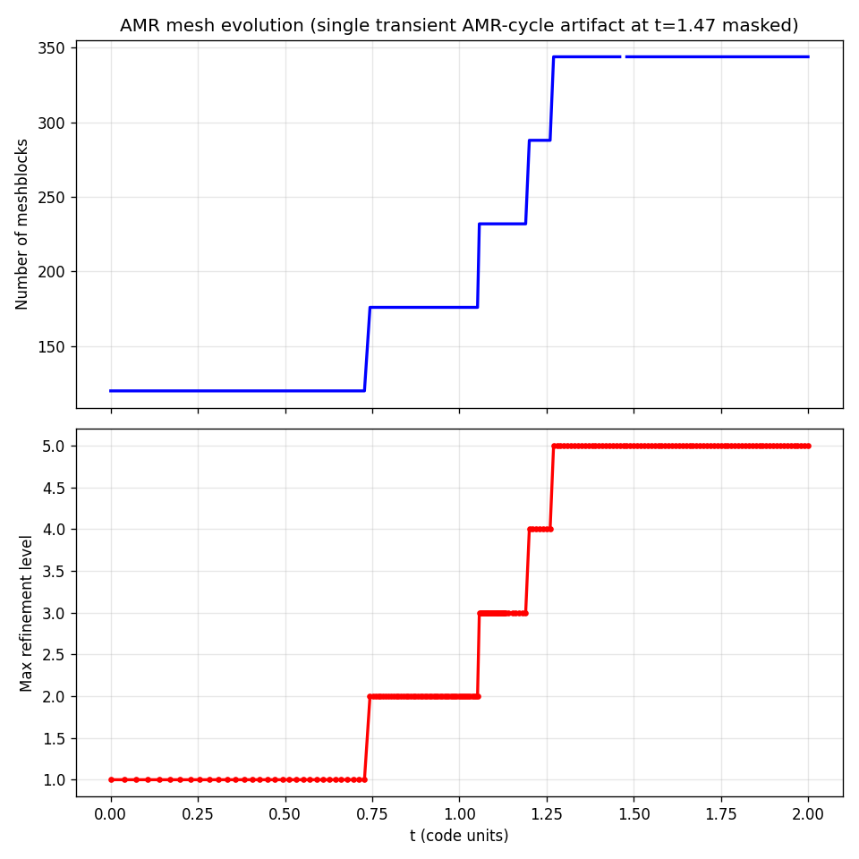

# Self-gravity

AthenaPK can evolve the gas under its own gravity by solving the Poisson equation

$$\nabla^2 \phi = 4\pi G\,\rho$$

each timestep and adding the resulting acceleration $-\nabla\phi$ as an unsplit
source term to the momentum and total-energy equations. The solver is a port of the
Artemis self-gravity module and is built on Parthenon's geometric-multigrid (GMG)
infrastructure.

## Algorithm

- The potential `grav.phi` and the right-hand side `grav.rhs` $= 4\pi G(\rho-\bar\rho)$
  are cell-centered fields registered by the `self_gravity` package. Both are written
  to `hdf5` output when listed in a `variables` line.
- The Poisson equation is solved with a **BiCGSTAB Krylov solver preconditioned by
  geometric multigrid** (`parthenon::solvers::BiCGSTABSolver` +
  `MGSolver`), which converges robustly on the block-AMR hierarchy.
- The solve is submitted once per step, on the final stage of the integrator
  (`HydroDriver::MakeTaskCollection`), followed by an Artemis-style flux-weighted
  gravitational source term (`ApplyGravitySource`) for improved energy conservation
  under AMR.
- For fully periodic domains the **Jeans swindle** (`use_swindle`) subtracts the mean
  density so the periodic Poisson problem is well posed.

## Enabling self-gravity

Add to the `<physics>` block and provide a `<self_gravity>` block. The mesh must have
multigrid enabled.

```
<parthenon/mesh>
multigrid = true          # required by the GMG-preconditioned solver

<physics>
self_gravity = true

<self_gravity>
units_override = true     # required in v1 (code-unit gravitational constant)
four_pi_G      = 1.0      # value of 4*pi*G in code units
use_swindle    = true     # subtract mean density (default: true iff fully periodic)

# Gravity boundary conditions, per face (ix1_bc/ox1_bc/.../ix3_bc/ox3_bc).
# "default" inherits the hydro BC; "zero" imposes homogeneous Dirichlet (phi=0).
ix1_bc = zero
ox1_bc = zero
# ... etc

<self_gravity/solver_params>
preconditioner               = Multigrid
max_iterations               = 200
residual_tolerance           = 1.0e-10
absolute_residual_tolerance  = 1.0e-10
relative_residual            = true
relative_residual_tolerance  = 1.0e-6
```

### Input parameters

| Block | Parameter | Default | Meaning |
|-------|-----------|---------|---------|
| `<physics>` | `self_gravity` | `false` | Master switch; adds the `self_gravity` package. |
| `<parthenon/mesh>` | `multigrid` | `false` | Must be `true`; enables the GMG hierarchy. |
| `<self_gravity>` | `units_override` | `true` | Must be `true` in v1 (gravitational constant set in code units). |
| `<self_gravity>` | `four_pi_G` | `1.0` | Value of $4\pi G$ in code units. |
| `<self_gravity>` | `use_swindle` | periodic? | Subtract the mean density from the RHS. Defaults to `true` for a fully periodic domain, `false` otherwise. |
| `<self_gravity>` | `{i,o}x{1,2,3}_bc` | `default` | Per-face gravity BC. `default` follows the hydro BC; `zero` = homogeneous Dirichlet. |
| `<self_gravity>` | `packed_bc` | `true` | Apply the `zero`/`neumann` $\phi$ BCs to a whole `MeshData` in one kernel per face during the solve (large GPU launch-latency saving at deep AMR; bit-identical to the per-block path). Automatically falls back to the per-block path for any other face type. |
| `<self_gravity/solver_params>` | `solver` | `BiCGSTAB` | `BiCGSTAB` = GMG-preconditioned Krylov solver (robust default). `MG` = pure geometric multigrid, which avoids the two global reductions per Krylov iteration (helps latency-bound multi-rank GPU runs) but requires at least the SRJ2 smoother (the Parthenon `MGParams` default) on AMR grids. |
| `<self_gravity/solver_params>` | `preconditioner` | `Multigrid` | Krylov preconditioner. |
| `<self_gravity/solver_params>` | `max_iterations` | — | Maximum Krylov iterations per solve. |
| `<self_gravity/solver_params>` | `residual_tolerance`, `relative_residual_tolerance`, `absolute_residual_tolerance` | — | Convergence tolerances (see Parthenon solver docs). |

> **Boundary-condition caveat.** Each face may be `zero` (homogeneous Dirichlet,
> $\phi=0$), `neumann` (homogeneous Neumann, $\partial\phi/\partial n=0$, e.g. a
> symmetry plane), or `default` (inherit the hydro BC; periodic faces give a periodic
> $\phi$). An **all**-Neumann domain is gauge-unfixed (the potential is then determined
> only up to an additive constant) and isolated-mass (multipole) BCs are **not**
> implemented — use `zero` Dirichlet faces for isolated collapse problems (as in
> `inputs/collapse_be.in`).

## Jeans-length refinement

The port adds a refinement criterion that keeps the local Jeans length resolved by at
least `njeans` cells (Truelove et al. 1997), which is essential for suppressing
artificial fragmentation during collapse:

```
<parthenon/mesh>
refinement = adaptive

<refinement>
type   = jeans
njeans = 8            # refine when lambda_J / dx < njeans (typically 8-16)
```

A block is flagged for refinement when $\lambda_J/\Delta x < N_{\rm Jeans}$ and for
derefinement when $\lambda_J/\Delta x > 2.5\,N_{\rm Jeans}$, with
$\lambda_J = 2\pi c_s/\sqrt{\rho}$ (hydro) or $2\pi(c_s+v_A)/\sqrt{\rho}$ (MHD) in
$4\pi G=1$ units.

## Example problems

Two problem generators exercise the solver and ship with matching input decks:

- **`jeans`** (`src/pgen/jeans.cpp`, `inputs/jeans_stable.in`, `inputs/jeans_unstable.in`)
  — a uniform periodic box with a small sinusoidal density perturbation, used to
  validate the linear Jeans dispersion relation.
- **`collapse_be`** (`src/pgen/collapse_be.cpp`, `inputs/collapse_be.in`) — collapse of
  a marginally-stable Bonnor-Ebert sphere with barotropic cooling, driven to
  first-hydrostatic-core densities.

## Validation

### Jeans dispersion relation

The `jeans` regression test (`tst/regression/test_suites/jeans`) seeds a small
sinusoidal perturbation with zero initial velocity and checks the evolution of the
total kinetic energy against linear theory,

$$\omega^2 = k^2 c_s^2 - 4\pi G\rho_0,$$

for both the stable ($\omega^2>0$, oscillating) and unstable ($\omega^2<0$, growing)
regimes. The measured oscillation frequency and growth rate agree with the analytic
dispersion relation to within a few percent.


### Bonnor-Ebert collapse and cross-code comparison

The `collapse_be` setup collapses to first-core densities and, in a matched-physics
comparison, tracks the reference CT-MHD code Athena++ on the same problem. The peak
density runs away by $>5$ orders of magnitude and crosses $\rho_{\rm crit}$ at nearly
the same time in both codes, while the Jeans-length AMR criterion progressively adds
refinement levels as the core forms.




## Parthenon dependency

The solver relies on Parthenon's `solvers/` GMG infrastructure
(`bicgstab_solver.hpp`, `mg_solver.hpp`, `internal_prolongation.hpp`), available from
Parthenon v25.12 onward. Multi-rank **GPU** runs additionally require the
flux-correction communication-fence fix
([parthenon#1405](https://github.com/parthenon-hpc-lab/parthenon/pull/1405)) to avoid
a GMG race on the AMR hierarchy; the Parthenon submodule pinned by this repository
includes that fix.
