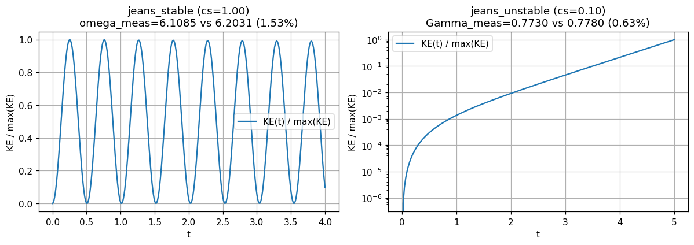
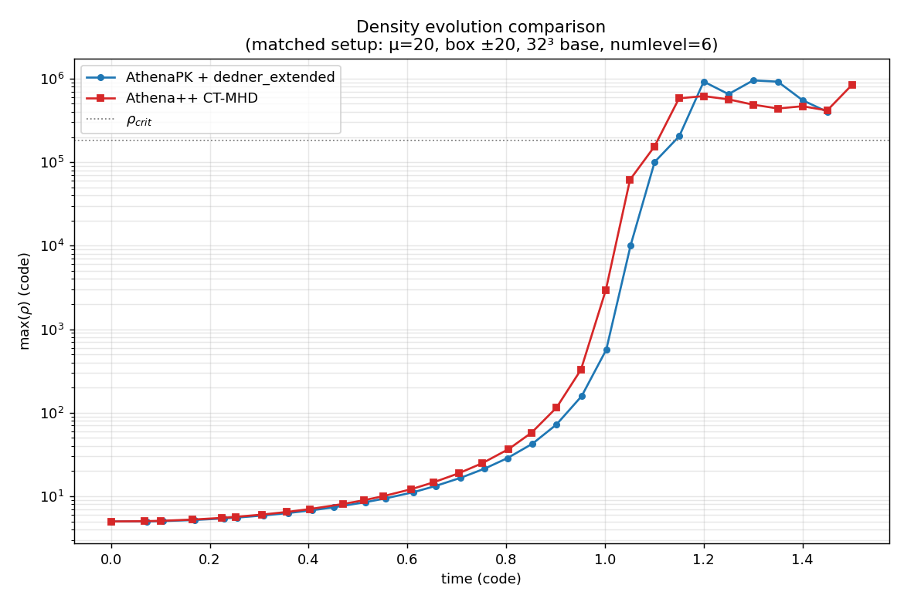

# Self-gravity

AthenaPK can evolve the gas under its own gravity by solving the Poisson equation

$$\nabla^2 \phi = 4\pi G\,\rho$$

on every stage of the integrator and adding the resulting acceleration $-\nabla\phi$ as
an unsplit source term to the momentum and total-energy equations. The solver is a port of the
[Artemis](https://github.com/lanl/artemis) self-gravity module and is built on
Parthenon's geometric-multigrid (GMG) infrastructure.

## Algorithm

- The potential `grav.phi` and the right-hand side `grav.rhs` $= 4\pi G(\rho-\bar\rho)$
  are cell-centered fields registered by the `self_gravity` package. Both are written
  to output (`hdf5` as well as OpenPMD) when listed in a `variables` line.
- The Poisson equation is solved with a **BiCGSTAB Krylov solver preconditioned by
  geometric multigrid** (`parthenon::solvers::BiCGSTABSolver` +
  `MGSolver`), which converges robustly on the block-AMR hierarchy.
- The solve is **stage-consistent**: the Poisson equation is solved once per integrator
  stage from that stage's density, and the Artemis-style flux-weighted gravitational
  source term (`ApplyGravitySource`) carries the stage's $\beta\,\Delta t$ weight, exactly
  like the hydro flux update and the other unsplit sources. Both the predictor and the
  corrector of the VL2 integrator therefore feel gravity. The cost is one extra elliptic
  solve per step.
- **Measured temporal order.** On the unstable Jeans mode (128 cells, $c_s=0.1$, $t=5$),
  Richardson extrapolation of the final modal amplitude over a CFL ladder gives ratios
  2.28, 2.15, 2.08 for the triples 0.2/0.1/0.05, 0.1/0.05/0.025 and 0.05/0.025/0.0125 —
  monotonically approaching 2, i.e. **the gravitational coupling converges at first order
  in $\Delta t$**, not second, even though the surrounding VL2 scheme is second order.
  Stage-consistency still matters a great deal for the error *coefficient*: evaluating the
  source from the already-updated conserved state instead of the start-of-stage
  primitives costs a further factor of ~30 in temporal error at fixed CFL.

  This is a property of the source-term formulation, not of this port: Athena++ applies
  the same Mullen, Hanawa & Gammie (2020) momentum form with the same per-stage
  $\beta\,\Delta t$ weighting from start-of-stage primitives, and Artemis uses the same
  expression again. The identical measurement on Athena++'s own `jeans` problem generator
  with multigrid gravity, matched so that $4\pi G\rho_0/(k^2c_s^2)$ is the same 2.533,
  gives ratios 2.23 and 2.11 (p = 1.16, 1.08) against AthenaPK's 2.28, 2.15 and 2.08
  (p = 1.19, 1.10, 1.06) — the same behaviour within the scatter. Reaching second order
  would require changing the source-term formulation rather than solving more often.
- The source term writes interior cells only and runs after the stage's boundary
  exchange (the solve is global, so it cannot sit inside the stage task list), so the
  ghost zones are re-communicated before `FillDerived`. Without that, the next stage's
  reconstruction would use ghost values missing one gravitational kick.
- For fully periodic domains the **Jeans swindle** (`use_swindle`) subtracts the mean
  density so the periodic Poisson problem is well posed.

## Enabling self-gravity

Self-gravity is enabled from its own block by selecting a Poisson solver. The mesh must
have multigrid enabled.

```
<parthenon/mesh>
multigrid = true          # required by the GMG-preconditioned solver

<self_gravity>
solver         = multigrid  # "none" (default) disables self-gravity
four_pi_G      = 1.0        # value of 4*pi*G in code units; omit if a <units> block is given
use_swindle    = true       # subtract mean density (default: true iff fully periodic)

# Gravity boundary conditions, per face (ix1_bc/ox1_bc/.../ix3_bc/ox3_bc).
# "default" inherits the hydro BC; "zero" imposes homogeneous Dirichlet (phi=0).
ix1_bc = zero
ox1_bc = zero
# ... etc

<self_gravity/multigrid_solver_params>
preconditioner               = Multigrid
max_iterations               = 200
residual_tolerance           = 1.0e-10
absolute_residual_tolerance  = 1.0e-10
relative_residual            = true
relative_residual_tolerance  = 1.0e-6
```

### The gravitational constant

There are two mutually exclusive ways to set $4\pi G$:

- **A `<units>` block is present.** $4\pi G$ is computed from the code units via
  AthenaPK's `Units` class, and `self_gravity/four_pi_G` must *not* be set. Setting
  both is an error, because the two could silently disagree.
- **No `<units>` block.** The problem is posed directly in code units and
  `self_gravity/four_pi_G` sets the constant (default `1.0`, the usual normalization
  of the Jeans and Bonnor-Ebert setups).

### Input parameters

| Block | Parameter | Default | Meaning |
|-------|-----------|---------|---------|
| `<self_gravity>` | `solver` | `none` | Poisson solver. `multigrid` enables self-gravity via the GMG infrastructure; `none` disables the package. |
| `<parthenon/mesh>` | `multigrid` | `false` | Must be `true`; enables the GMG hierarchy. |
| `<self_gravity>` | `four_pi_G` | `1.0` | Value of $4\pi G$ in code units. Must be absent if a `<units>` block is given. |
| `<self_gravity>` | `use_swindle` | periodic? | Subtract the mean density from the RHS. Defaults to `true` for a fully periodic domain, `false` otherwise. |
| `<self_gravity>` | `{i,o}x{1,2,3}_bc` | `default` | Per-face gravity BC. `default` follows the hydro BC; `zero` = homogeneous Dirichlet. |
| `<self_gravity>` | `packed_bc` | `true` | Apply the `zero`/`neumann` $\phi$ BCs to a whole `MeshData` in one kernel per face during the solve (large GPU launch-latency saving at deep AMR; bit-identical to the per-block path). Automatically falls back to the per-block path for any other face type. |
| `<self_gravity/multigrid_solver_params>` | `solver_type` | `BiCGSTAB` | `BiCGSTAB` = GMG-preconditioned Krylov solver (robust default). `MG` = pure geometric multigrid, which avoids the two global reductions per Krylov iteration (helps latency-bound multi-rank GPU runs) but requires at least the SRJ2 smoother (the Parthenon `MGParams` default) on AMR grids. |
| `<self_gravity/multigrid_solver_params>` | `preconditioner` | `Multigrid` | Krylov preconditioner. |
| `<self_gravity/multigrid_solver_params>` | `max_iterations` | — | Maximum Krylov iterations per solve. |
| `<self_gravity/multigrid_solver_params>` | `residual_tolerance`, `relative_residual_tolerance`, `absolute_residual_tolerance` | — | Convergence tolerances, see the [Parthenon solver documentation](https://parthenon-hpc-lab.github.io/parthenon/develop/src/solvers.html). |

> **Boundary-condition caveat.** Each face may be `zero` (homogeneous Dirichlet,
> $\phi=0$), `neumann` (homogeneous Neumann, $\partial\phi/\partial n=0$, e.g. a
> symmetry plane), or `default` (inherit the hydro BC; periodic faces give a periodic
> $\phi$). An **all**-Neumann domain is gauge-unfixed (the potential is then determined
> only up to an additive constant) and isolated-mass (multipole) BCs are **not**
> implemented — use `zero` Dirichlet faces for isolated collapse problems (as in
> `inputs/collapse_be.in`).

## Jeans-length refinement

The port adds a refinement criterion that keeps the local Jeans length resolved by at
least `njeans` cells (Truelove et al. 1997), which is essential for suppressing
artificial fragmentation during collapse:

```
<parthenon/mesh>
refinement = adaptive

<refinement>
type   = jeans
njeans = 8            # refine when lambda_J / dx < njeans (typically 8-16)
```

A block is flagged for refinement when $\lambda_J/\Delta x < N_{\rm Jeans}$ and for
derefinement when $\lambda_J/\Delta x > 2.5\,N_{\rm Jeans}$, with
$\lambda_J = 2\pi c_s/\sqrt{\rho}$ (hydro) or $2\pi(c_s+v_A)/\sqrt{\rho}$ (MHD) in
$4\pi G=1$ units.

## Example problems

Two problem generators exercise the solver and ship with matching input decks:

- **`jeans`** (`src/pgen/jeans.cpp`, `inputs/jeans.in`) — a uniform periodic box with a
  small sinusoidal density perturbation, used to validate the linear Jeans dispersion
  relation. The deck runs the Jeans-unstable regime; comment/uncomment `cs` for the
  stable one.
- **`collapse_be`** (`src/pgen/collapse_be.cpp`, `inputs/collapse_be.in`) — collapse of
  a marginally-stable Bonnor-Ebert sphere, driven to first-hydrostatic-core densities.
  Note that despite `<hydro> eos = adiabatic`, this setup is **not** an ideal-gas run:
  its problem-specific unsplit source term overwrites the thermal energy every stage
  with a barotropic equation of state, $e_{\rm th} = \rho/(\gamma-1)\sqrt{1 +
  (\rho/\rho_{\rm crit})^{2(\gamma-1)}}$, which is exactly isothermal below
  $\rho_{\rm crit}$ and stiffens to an adiabat of index $\gamma$ above it. `gamma`
  therefore only sets the stiff branch. The same source also zeroes the momentum outside
  the sphere radius, i.e. it imposes a fixed-velocity boundary on the ambient medium.

## Validation

### Jeans dispersion relation

The `jeans` regression test (`tst/regression/test_suites/jeans`) seeds a small
sinusoidal perturbation with zero initial velocity and checks the evolution of the
total kinetic energy against linear theory,

$$\omega^2 = k^2 c_s^2 - 4\pi G\rho_0,$$

for both the stable ($\omega^2>0$, oscillating) and unstable ($\omega^2<0$, growing)
regimes. The measured oscillation frequency and growth rate agree with the analytic
dispersion relation to within a few percent.



### Bonnor-Ebert collapse and cross-code comparison

The `collapse_be` setup collapses to first-core densities and, in a matched-physics
comparison, tracks the reference CT-MHD code Athena++ on the same problem. The peak
density runs away by $>5$ orders of magnitude and crosses $\rho_{\rm crit}$ at nearly
the same time in both codes, while the Jeans-length AMR criterion progressively adds
refinement levels as the core forms.


